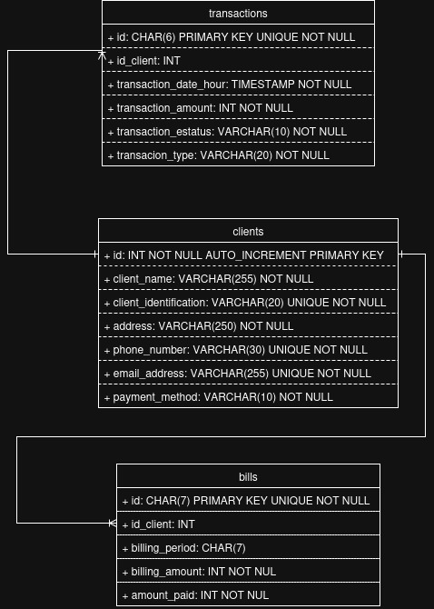

# Data normalization and CRUD + query system development

Financial information management that organizes and structures information in a **SQL** database, facilitating its loading, storage, and subsequent management using a **CRUD** system.
The backend is built with **Node.js** and **Express**, the database is managed with **MySQL**.

---

## Technologies used

- Node.js
- Express.js
- dotenv
- csv-parser
- MySQL
- HTML, CSS, JavaScript (Frontend)
- csv-parser (To load data from files CSV)
- vite

---

## Project structure

```bash
biblioteca/
│
├── docs/ # Documentation
│       ...
├── app/ # Frontend (HTML, CSS, JS)
│       ...
├── server/ # Backend
│       ...
├── index.html 
├── .env # Variables de entorno
├── .gitignore
└── README.md
```

## Instalation

1. Clone the repository:

```bash
git clone 
cd biblioteca
```

1. Install dependencies:

```bash
npm install
```

3. Create and configure the file .env:

```bash
DB_HOST=localhost
DB_USER=root
DB_PASSWORD=password
DB_NAME=db_name
DB_PORT=3306
```

4. Initialize the backend:

```bash
node server/index.js por corregir
```

5. Initialize the frontend:

```bash
npm run dev
```

## The server will be available at

```bash
http://localhost:3000
```

## Endpoints available

```bash
| method | route             | Description                 |
| ------ | ----------------- | --------------------------- |
| GET    | /api/v1/prestamos | Obtener todos los préstamos |
| GET    | /api/v1/prestamos | Obtener un préstamo por ID  |
| POST   | /api/v1/prestamos | Crear un nuevo préstamo     |
| PUT    | /api/v1/prestamos | Actualizar un préstamo      |
| DELETE | /api/v1/prestamos | Eliminar un préstamo        |
  
```

## Database documentation

### Database name

`pd_yoelmis_perdomo_tayrona`

---

### Entity-relationship diagram



---

### Tables

#### **clients**

| Field  | Data type | constraints | Description |
| ----------------- | ---------------- | ----------------------|--------------- |
| id| INT | NOT NULL AUTO_INCREMENT PRIMARY KEY | Unique identifier for the id|
|client_name |VARCHAR(255) |NOT NULL | contains the client name|
| id| INT | NOT NULL AUTO_INCREMENT PRIMARY KEY | Unique identifier for the id|
| id| INT | NOT NULL AUTO_INCREMENT PRIMARY KEY | Unique identifier for the id|
| id| INT | NOT NULL AUTO_INCREMENT PRIMARY KEY | Unique identifier for the id|
| id| INT | NOT NULL AUTO_INCREMENT PRIMARY KEY | Unique identifier for the id|

some descriptions
 PRIMARY KEY → Unique identifier for the `nombre de lo que identifica`,
 FOREING KEY → References `tabla.campo que referencia`
 `campo` name
 `campo` date
 `campo` description
 national identification number
 `campo` email address
 gender

----

#### Relationships

- **1 `uno`eje: un profesor  → N `muchos`puede tenemos muchos estudiantes**

---

## API  Endpoins Documentation

All API requests use the base URL: `(http://localhost:3000)`

---

### **ejemplo :  Historial de un libro por su ISBN**

**URL:** GET `/prestamos/historial/:isbn`
**Description:**
retruns a ...

**response 200 example:**

```json
   {
        "id_prestamo": 14,
        "fecha_prestamo": "2025-06-08T05:00:00.000Z",
        "fecha_devolucion": "2025-08-12T05:00:00.000Z",
        "estado": "activo",
        "usuario": "Helena Micaela Alvarado",
        "isbn": "978-1-968004-87-3",
        "libro": "Modi beatae"
    }
`lo que regrese la respuesta de la query en postman`
```

---

**URL:** POST `ruta final`
**Description:**
Creates a...

**request body example:**

```json
   {
        "fecha_prestamo": "2025-06-08",
        "fecha_devolucion": "2025-08-12",
        "estado": "activo",
        "usuario": "Helena Micaela Alvarado",
        "isbn": "978-1-968004-87-3",
        "libro": "Modi beatae"
    }
`lo que envias en el body de la query en postman`
```

**response 200 example:**

```json
{
    "mensaje": "prestamo creado exitosamente"
}
`lo que regrese la respuesta de la query en postman`
```

---

**URL:** PUT `/prestamos/31`
**Description:**
Updates a...

**Path Paramenters:**
| Name | Type | Required | Description |
| id---- | int---- | yes-------- | id to update----------- |

some description:
`campo` to update

**request body example:**

```json
 {
        "fecha_prestamo": "2025-06-08",
        "fecha_devolucion": "2025-08-12",
        "estado": "entregado",
        "usuario": "Helena Micaela Alvarado",
        "isbn": "978-1-968004-87-3",
        "libro": "Modi beatae"
    }
`lo que envias en el body de la query en postman`
```

**response 200 example:**

```json
{
    "mensaje": "prestamo actualizado"
}
`lo que regrese la respuesta de la query en postman`
```

---

**URL:** DELETE `/prestamos/31`
**Description:**
Deletes a...

**Path Paramenters:**

| Name | Type | Required | Description |
| ---- | ---- | -------- | ----------- |

some description:
`campo` to delete

**response 200 example:**

```json
{
    "mensaje": "prestamo eliminado"
}
`lo que regrese la respuesta de la query en postman`
```
